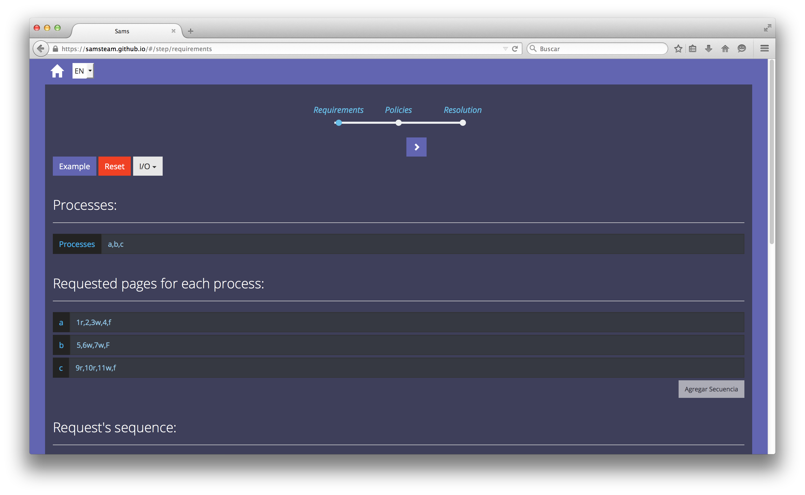
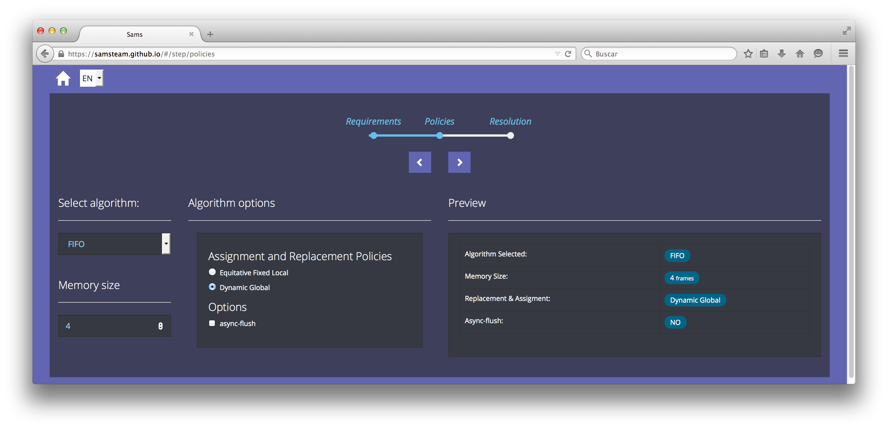
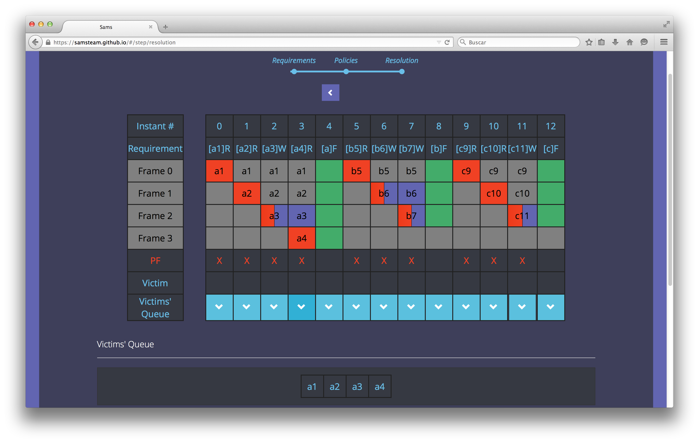

# SAMS - Some Awesome Memory Scheduler

# Integrantes
* Natalia Aparicio
* Ignacio Babbini
* Bruno Cascio
* Cirano Eusebi
* Cristian Sottile

# Objetivo
El objetivo del proyecto es el desarrollo de un software que simule los diferentes algoritmos mediante los cuales el sistema operativo gestiona la memoria en las computadoras.

# Motivación
Una de las unidades temáticas de la cursada de la materia Introducción a los Sistemas Operativos es **la memoria y su administración por parte del sistema operativo**. Existen diferentes algoritmos mediante los cuales este último lleva a cabo dicha tarea.

En la parte práctica de la unidad se diagrama la atención a las solicitudes de carga y descarga de datos por parte de los procesos. Los ejercicios consisten en indicar, para cada instante de memoria, los datos presentes en ella, emulando así el comportamiento que ofrecería el algoritmo real.

Durante este modelo de resolución nos encontramos con dos circunstancias mejorables: 

##### La realización del diagrama
Como para cada instante de memoria se deben escribir todos los datos, el proceso se vuelve tedioso y repetitivo, e invita al estudiante a perder el foco atendiendo cuestiones ajenas a la forma concreta en que el algoritmo gestiona la memoria, que es la clave de la resolución de los ejercicios.

##### La resolución de dudas
En algunas ocasiones, la situación escapa del flujo ideal, y la respuesta que ofrecería el algoritmo no resulta obvia.

Nos pareció que sería útil para los alumnos poseer una herramienta que agilice esas dos actividades, permitiendo al usuario ingresar los datos del ejercicio, y proveyendo:

* La resolución automática, como lo harían los diferentes algoritmos. Esto permitiría solventar dudas de forma sencilla.
* Un esqueleto de diagrama para que complete el usuario, resolviendo de forma manual el ejercicio, y pudiéndo compararlo luego de forma automática con la resolución generada por la herramienta. Esto permitiría, además de la verificación de la correctitud de los ejercicios, que el proceso de resolución se centre en la esencia del mismo, *cómo el algoritmo resuelve las solicitudes*, gracias a la eliminación de la parte repetitiva y sin importancia.

# Tecnología
La aplicación se desarrolló como un servicio web, para lo cual se utilizaron mayormente herramientas y frameworks basados en Javascript:

# Tecnologías usadas

Las tecnologías usadas fueron elegidas por diversas razones entre ellas:
	- Aprendizaje: Somos inquietos, siempre queremos aprender cosas nuevas.
	- Portabilidad: Javascript al ejecutarse mayormente sobre browsers, es independiente del SO.
	- Reutilización: Hacemos la web y luego con un comando la convertimos en una aplicación de escritorio para todos los sistemas operativos. ¡SI! se codifica sólo una vez :D
	 
Diferenciamos **Backend** de **Frontend**.

## Backend

El backend representa el detrás de escena de lo que ve el usuario final. Todo el procesamiento y el cálculo "pesado".

### NodeJS & NPM

Se utilizó el entorno javascript [NodeJS](https://nodejs.org) para la implementación de los algoritmos de planificación de memoria en conjunto con [npm](https://www.npmjs.com/) para la gestion de dependencias del proyecto.

El [diseño de los algoritmos](https://github.com/samsteam/sams-core/blob/master/docs/wiki/home.md#class-diagram) fue completamente orientado a objetos, y para mantener consistencia entre el diseño y la implementación, se utilizó la librería [cocktailJS](http://cocktailjs.github.io/) para el uso de "Clases" en lugar de "Prototipos" (nativo de javascript).

Agradecimiento al creador de esta última librería [@elmasse](https://github.com/elmasse) por el soporte.

### MochaJS

Una de las técnicas utilizadas en el desarrollo fue la de [TDD](https://en.wikipedia.org/wiki/Test-driven_development) en la que se involucró el Framework [mochajs](https://mochajs.org) para los tests.

Se realizaron tests de unidad para cada componente del core, y luego test de integración (manuales) para corroborar el correcto funcionamiento de los algoritmos.

## Frontend

El frontend representa lo que el usuario final ve y con lo que interactúa para obtener los resultados que desea.

### AngularJS

[AngularJS](https://angularjs.org/) es un framework **MVW** (Model View Whatever) del lado del cliente creado por [Google](https://google.com), que facilita el desarrollo de aplicaciones web/híbridas, ya que otorga entre sus bondades, bindings en tiempo real, código modularizado (gracias a su patrón MVW), etc.

### GruntJS

Muchas veces los desarrolladores se encuentran con tareas repetitivas a la hora de desarrollar, como agregar librerías JS o CSS a sus proyectos, y la tarea tediosa y propensa a errores de agregar manualmente cada una de ellas.
[GruntJS](http://gruntjs.com/) es un automatizador de tareas que mantiene todo esto bajo control y de manera transparente para el desarrollador. Además brinda algunas **tareas** (*tasks*) para el desarrollo, como concatenación y minificación de archivos para una optimización con todo lo relacionado a el mundo web.

### BootstrapCSS

Como aquí somos todos programadores y ninguno diseñador, no queremos pelearnos con colores o interminables guerras entre medidas relativas o absolutas. Por eso elegimos [Bootstrap](http://getbootstrap.com/) como framework CSS para todo lo relacionado con el diseño gráfico de cara al usuario.

### NW (Node Webkit)

[NW ó Node Webkit](http://nwjs.io/) es una tecnología que permite "embeber" nuestra web y tratarla como una aplicación de escritorio.
Esta tecnología se utilizó para proveer una versión **offline** de la aplicación.

# Prototipo generado

# Conclusiones

# Trabajo futuro
Se consideraron algunas ideas para la extensión futura del software, tanto para incrementar sus capacidades como para mejorar la experiencia de usuario:
Durante el desarrollo del proyecto surgieron algunas ideas que, si bien no estuvieron pevistas desde un primer momento, resultan deseables de adherir a la aplicación, 

* Desarrollar diferentes modalidades para el modo interactivo de la aplicación, como agregar temporizadores y/o diferentes dificultades.
* Realizar una corrección de errores más descriptiva.
* Proveer una explicación instante a instante del porqué de las desiciones del manejador de memoria en el modo pasivo.
* Agregar más combinaciones de politicas y algoritmos.
