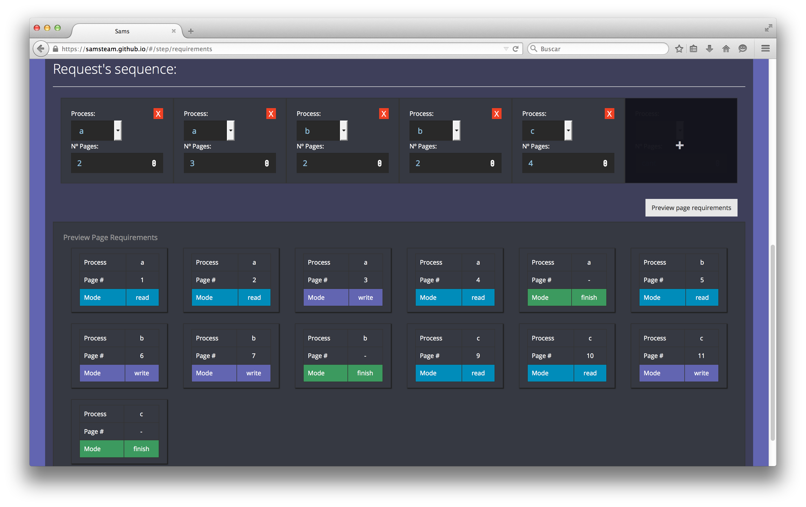

# SAMS - Some Awesome Memory Scheduler

# Integrantes
* Natalia Aparicio - 12667/7
* Ignacio Babbini - 10475/1
* Bruno Cascio - 12512/7
* Cirano Eusebi - 12469/2
* Cristian Sottile - 12222/2
* Nicolás Macia - Coordinador técnico

# Objetivo
El objetivo del proyecto es el desarrollo de un software que simule los diferentes algoritmos mediante los cuales el sistema operativo gestiona la memoria en las computadoras.

# Motivación
Una de las unidades temáticas de la cursada de la materia Introducción a los Sistemas Operativos es **la memoria y su administración por parte del sistema operativo**. Existen diferentes algoritmos mediante los cuales este último lleva a cabo dicha tarea.

En la parte práctica de la unidad se diagrama la atención a las solicitudes de carga y descarga de datos por parte de los procesos. Los ejercicios consisten en indicar, para cada instante de memoria, los datos presentes en ella, emulando así el comportamiento que ofrecería el algoritmo real.

Durante este modelo de resolución nos encontramos con dos circunstancias mejorables: 

#### La realización del diagrama
Como para cada instante de memoria se deben escribir todos los datos, el proceso se vuelve tedioso y repetitivo, e invita al estudiante a perder el foco atendiendo cuestiones ajenas a la forma concreta en que el algoritmo gestiona la memoria, que es la clave de la resolución de los ejercicios.

#### La resolución de dudas
En algunas ocasiones, la situación escapa del flujo ideal, y la respuesta que ofrecería el algoritmo no resulta obvia.

Nos pareció que sería útil para los alumnos poseer una herramienta que agilice esas dos actividades, permitiendo al usuario ingresar los datos del ejercicio, y proveyendo:

* La resolución automática, como lo harían los diferentes algoritmos. Esto permitiría solventar dudas de forma sencilla.
* Un esqueleto de diagrama para que complete el usuario, resolviendo de forma manual el ejercicio, y pudiéndo compararlo luego de forma automática con la resolución generada por la herramienta. Esto permitiría, además de la verificación de la correctitud de los ejercicios, que el proceso de resolución se centre en la esencia del mismo, *cómo el algoritmo resuelve las solicitudes*, gracias a la eliminación de la parte repetitiva y sin importancia.

# Tecnologías utilizadas
La aplicación se desarrolló como un servicio web, para lo cual se utilizaron mayormente herramientas y frameworks basados en JavaScript, siendo los motivos por los cuales las elegimos el aprendizaje de nuevas tecnologías y la portabilidad del lenguaje.

A continuación las describimos, haciendo una separación entre las pertenecientes al *backend* y al *frontend*.

### Backend
Consiste en el procesamiento interno realizado por la aplicación.

##### NodeJS & NPM
Se utilizó el entorno javascript NodeJS para la implementación de los algoritmos de planificación de memoria en conjunto con NPN (Node Package Manager) para la gestion de dependencias del proyecto.

##### CocktailJS
El diseño de los algoritmos fue completamente orientado a objetos, y, para mantener consistencia entre el diseño y la implementación, nos valimos de la librería CocktailJS para el uso de *clases* en lugar de los *prototipos* nativos de JavaScript.

##### MochaJS
Una técnica que aplicamos en el desarrollo fue la de TDD (Test Driven Development), para lo que se involucró el framework Mocha.js. Se implementaron tests de unidad para cada componente del core, y luego tests de integración (manuales) para corroborar el correcto funcionamiento de los algoritmos.

### Frontend
Representa a la interfaz con la que el usuario interactúa.

##### AngularJS
AngularJS es un framework **MVW** (Model View Whatever) creado por Google, que funciona del lado del cliente y facilita el desarrollo de aplicaciones web/híbridas, ya que otorga, entre otras bondades, bindings en tiempo real y código modularizado.

##### GruntJS
Para evitar las tareas repetitivas y propensas a errores, tales como agregar manualmente librerías CSS y JS, hicimos uso de GruntJS, un automatizador de tareas que, de manera transparente, mantiene estas cuestiones bajo control. También provee optimizaciones relevantes al mundo web, como la concatenación y minificación de archivos.

##### Bootstrap
Para lograr que la herramienta tenga un gran aspecto, utilizamos este framework CSS que provee una gran cantidad de elementos para el desarrollo web con un diseño gráfico estético y pulido.

##### Node Webkit
Node Webkit es una tecnología que permite embeber una web en una aplicación de escritorio. Mediante ella generamos la versión desktop del software.

# Prototipo generado
[SAMS-webapp](https://samsteam.github.io/#/home)

### Inicio

### Ingreso de requerimientos

### Selección de políticas

### Resolución

 
 
# Conclusiones
Se desarrolló la herramienta con las funcionalidades troncales implementadas. Se espera que la misma sea de ayuda e introduzca mejoras en el proceso de aprendizaje de los alumnos.

# Trabajo futuro
Se consideraron algunas ideas para la posterior extensión del software, tanto para incrementar sus capacidades como para mejorar la experiencia de usuario:

* Identificación de situaciones dudosas comunes en los diferentes algoritmos y explicación de las razones de la forma de resolución.
* Incremento de la descripción en las correcciones de errores.
* Provisión de una explicación instante a instante del porqué de las decisiones tomadas por el software en la resolución de los ejercicios.
* Inclusión de elementos enriquecedores de la aplicación como juego serio, por ejemplo temporizadores y diferentes niveles de dificultad.

# Bibliografía
* *Sistemas Operativos Modernos*, tercera edición (2009). Andrew S. Tanenbaum.
* *Sistemas Operativos*, quinta edición (2005). William Stallings.
* Material teórico y práctico de la cátedra de Introducción a los Sistemas Operativos (2014).